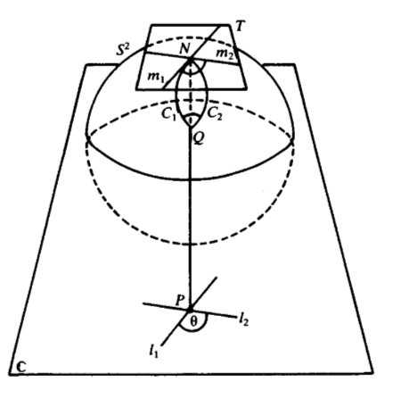

Some Notes on Differential Geometry, Analysis, and Analytic Number Theory
=========================================================================

These are my personal notes of select topics in mathematics, they are intended to complement
readings and lectures rather than taking their place. So they are going to be terse in places
where they ought to have more detail, or they may be sprinkled with many of my own personal thoughts
that are perhaps helpful to nobody but myself. Most of the material will be advanced undergraduate or beginner graduate level.

Smooth Manifolds
=================

.. image:: images/sphere.png
	:align: center

.. toctree::
	:maxdepth: 2
	:titlesonly:
	:glob:
   
todo

Analysis
=========

.. toctree::
	:maxdepth: 2
	:titlesonly:
	:glob:

	analysis/*

Analytic Number Theory
======================

.. toctree::
	:maxdepth: 2
	:titlesonly:
	:glob:

	analytic_nt/*
