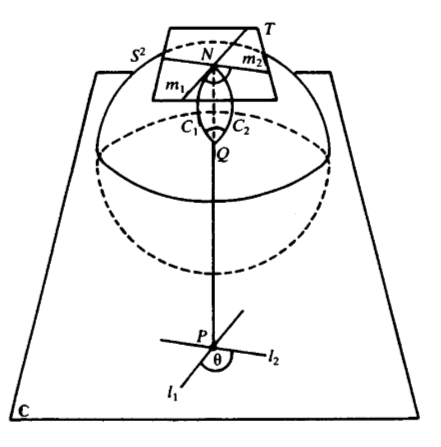

Some Notes on Differential Geometry, Analysis, and Analytic Number Theory
=========================================================================

These are my personal notes of select topics in mathematics, they are intended to complement
readings and lectures rather than taking their place. So they are going to be quite terse.
Will be adding to it over time.

Smooth Manifolds
=================

.. image:: images/sphere.png
	:align: center

.. toctree::
	:maxdepth: 2
	:titlesonly:
	:glob:
   
	smooth_manifolds/*

Complex Analysis
=================

todo.

Analytic Number Theory
======================

todo.
